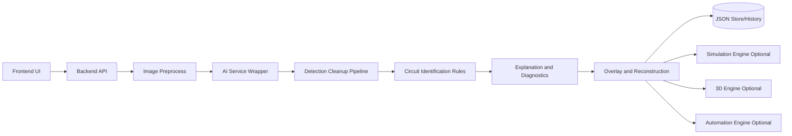

# Synthra Master Plan v1.0

Date: 2026-04-01
Version: 1.0
Planning Principle: Build in small, testable increments with visible UI output at every stage.

## 0) Project Principles (Locked)

1. Every task must fit one focused work session.
2. No simulation, 3D, or automation work begins before image understanding is stable.
3. Every stage must render a visible UI state.
4. Every module must ship with isolated tests before integration.
5. Use rule-based logic unless AI clearly adds value.
6. Prefer hosted APIs over local heavy models for constrained hardware.
7. Persist every intermediate result as JSON.
8. Every module defines input, output, errors, and logging.
9. Build tiny demo first, then expand.
10. Build as a chain of rocks, not one giant release.

## 1) Product Definition Decisions

### Product

- One-line statement: Synthra turns a circuit photo into understandable circuit insight, warnings, and guided improvements.
- User problem: Learners and engineers struggle to quickly identify what a real-world circuit does and what is wrong with it.
- Target user profile:
  - Primary: Students and beginners in electronics.
  - Secondary: Hobbyists and educators.
  - Tertiary: Engineers doing fast visual triage.

### Core Use Cases

1. Student uploads breadboard photo and gets component list plus simple explanation.
2. Hobbyist uploads LED circuit photo and gets likely wiring mistakes and fixes.
3. Educator demonstrates how circuit behavior changes with part changes.

### Out of Scope (Now)

1. Full SPICE-grade analog simulation.
2. Full PCB reverse engineering.
3. Enterprise auth and multi-tenant controls.
4. Custom component training pipeline.
5. Full CAD export compatibility.

### Success Criteria

- MVP:
  - Upload or camera image works reliably.
  - Returns cleaned component list and likely simple circuit label.
  - Generates beginner-safe explanation and warnings.
  - UI shows annotated image and actionable guidance.
- v1:
  - Adds reconstruction JSON, stronger diagnostics, and basic static simulation.
  - Adds project history, export, and robust test coverage.
- Advanced:
  - Adds richer simulation, 3D visualization, and automation workflows.

### Product Behavior Decisions

- Primary input type: Both image upload and camera capture.
- Primary output type: All (components, circuit label, explanation, warnings, suggestions).
- Initial complexity: Simple circuits first only.
- Supported image classes at launch: Breadboard photos first, schematic images second, PCB photos later.
- Unknown definition: Any component/topology below confidence threshold, unsupported label, or unresolved conflict.
- Low-confidence threshold: Warn below 0.65; require user confirmation below 0.50.
- Ask for more camera angles: Yes, when quality or topology confidence is low.
- Remember previous analyses: Yes, local history in MVP; optional cloud later.
- Explanation summary: Yes.
- Suggest fixes: Yes.
- Suggest enhancements: Yes, soft suggestions only.
- Eventual schematic generation: Yes (phase-gated).
- Eventual simulation: Yes (phase-gated).
- Eventual 3D visuals: Yes (phase-gated).
- Eventual automation: Yes (phase-gated).

### Priority Order

1. UI + image input reliability.
2. Detection cleanup and rule-based circuit identification.
3. Explanation + diagnostics.
4. Annotation overlay.
5. Reconstruction JSON.
6. Basic simulation.
7. Export + history.
8. Advanced AI, 3D, automation.

### Rollback Plan

1. Feature flags per major module (`ENABLE_SIM`, `ENABLE_3D`, `ENABLE_AUTOMATION`).
2. Keep stable fallback outputs (`unknown`, `needs_more_context`) always available.
3. Preserve last known good model version and prompt version.
4. Rollback trigger: error rate, latency, or confidence drift breaches threshold.

### Demo Script (5 Minutes)

1. Open landing page and pick sample LED circuit.
2. Show detected components and confidence badges.
3. Show likely circuit type and short explanation.
4. Show warning for missing resistor scenario.
5. Show fix suggestion and re-run with corrected sample.
6. Export report JSON.

### Explanations

- Non-technical: Synthra is a smart circuit helper that looks at a circuit photo and explains what is there, what might be wrong, and what to try next.
- Technical: Synthra is a modular photo-to-circuit analysis platform combining image preprocessing, hosted vision inference, rule-based topology identification, explanation templates, diagnostic logic, and phase-gated simulation/visualization modules with JSON contracts.

## 2) Architecture Planning

### 2.1 Box Diagram



### Runtime Placement

- Local:
  - Frontend app.
  - Backend API in development.
  - In-memory cache and temp files in MVP.
- Cloud:
  - Hosted AI API.
  - Optional managed storage/cache.
  - Optional observability stack.
- Optional modules:
  - Simulation, 3D, automation all behind flags.
- Phase-gated:
  - No activation until upstream confidence and tests pass.

### Data and Contracts

- Intermediate format: JSON only.
- API style: REST for MVP/v1.
- Base module call chain:
  - Input -> preprocess -> inference -> normalize -> identify -> explain -> diagnose -> output.

### Auth and Sessions

- MVP: No login required.
- v1 option: Session ID cookie plus local project history.

### Cache

- MVP cache: Memory + file hash key.
- v1 cache: Redis optional.
- Invalidation: content hash change, model version change, or TTL expiration.

### Ops Decisions

- Logging: Structured JSON logs with requestId.
- Metrics: latency, error rate, confidence distribution, retries, cache hit ratio.
- Health checks:
  - `/health` basic.
  - `/health/modules` per-module status.
- Fallback paths:
  - AI fail -> use sample rule fallback + user guidance.
  - Parse fail -> return safe unknown schema.
- Offline behavior: allow local UI and history browsing; disable cloud analysis gracefully.

### Limits and Safety

- Image size max: 10 MB.
- Preferred dimensions after preprocess: longest side 1600 px.
- Supported types: JPG, JPEG, PNG, WEBP.
- Timeout: 15 s soft, 30 s hard.
- Retry: exponential backoff, max 2 retries.
- Rate limit: 30 requests/minute per IP for MVP.
- Security boundary: uploaded files never executed; MIME and extension both validated.
- Retention: temp upload files deleted after analysis; keep only derived JSON unless user saves image.
- Sensitive data: blur metadata where possible, strip EXIF on stored processed image.

### Environments and Deployment

- Required env vars:
  - `SYNTHRA_ENV`
  - `PORT`
  - `AI_API_URL`
  - `AI_API_KEY`
  - `MAX_UPLOAD_MB`
  - `REQUEST_TIMEOUT_MS`
  - `RATE_LIMIT_PER_MIN`
  - `CACHE_TTL_SECONDS`
  - `ENABLE_SIM`
  - `ENABLE_3D`
  - `ENABLE_AUTOMATION`
  - `LOG_LEVEL`
- Secrets: env + secret manager in production.
- Deployment target:
  - Frontend: static host or edge platform.
  - Backend: container service.
- Domain strategy:
  - `app.synthra.dev`, `api.synthra.dev`, `app.synthra.com`, `api.synthra.com`.
- Versioning: semantic versioning with module contract versions.

## 3) JSON Schemas (Canonical Response Skeleton)

### 3.1 Image Analysis Response

```json
{
  "requestId": "req_123",
  "image": {
    "imageId": "img_123",
    "width": 1280,
    "height": 720,
    "quality": {
      "blurry": false,
      "dark": false,
      "anglePoor": false
    }
  },
  "components": [],
  "circuit": {
    "label": "battery_resistor_led",
    "family": "simple_dc",
    "complexity": "simple",
    "confidence": 0.82
  },
  "explanation": {
    "short": "...",
    "student": "...",
    "engineer": "..."
  },
  "warnings": [],
  "suggestions": [],
  "fixes": [],
  "enhancements": [],
  "guidance": {
    "askSecondAngle": false,
    "askCloserShot": false,
    "askTopDown": false
  },
  "reconstruction": null,
  "simulation": null,
  "scene3d": null,
  "automation": null,
  "status": "ok"
}
```

### 3.2 Component Object

```json
{
  "id": "cmp_001",
  "label": "resistor",
  "canonicalLabel": "resistor",
  "confidence": 0.91,
  "bbox": { "x": 100, "y": 120, "w": 80, "h": 30 },
  "orientation": "horizontal",
  "polarity": "na",
  "role": "current_limit",
  "unknown": false
}
```

### 3.3 Error and Warning Objects

```json
{
  "code": "LOW_CONFIDENCE",
  "message": "Detection confidence is low for one or more components.",
  "severity": "medium",
  "componentId": "cmp_003",
  "action": "Retake photo from top-down with better lighting."
}
```

## 4) Rock-Chain Roadmap (Phase-Gated)

## Phase A: MVP Path (Must Pass Before Anything Advanced)

Goal: Image -> Components -> Circuit label -> Explanation -> Warnings in UI.

### Rock A1: Product + Contract Lock

- Deliverables:
  - Product statement, scope, and out-of-scope.
  - JSON contracts for analysis request/response.
- Visible UI output: static mock result card.
- Tests: schema validation unit tests.

### Rock A2: UI Foundation

- Deliverables:
  - Landing screen, upload/camera zones, preview, result panels.
  - Loading, error, empty states.
  - Accessibility labels and keyboard controls.
- Visible UI output: upload and state transitions.
- Tests: UI state rendering tests.

### Rock A3: Image Input Module

- Deliverables:
  - Upload validation, drag-drop, camera capture.
  - Compression/resize/orientation handling.
  - Quality hints (dark/blurry/angle prompts).
- Visible UI output: thumbnail + quality badges.
- Tests: preprocessing + validation tests.

### Rock A4: Backend Foundation

- Deliverables:
  - Health endpoint, analysis endpoint, middleware stack.
  - requestId, logging, timeout, retry, rate-limit.
- Visible UI output: health status in settings panel.
- Tests: API contract and middleware tests.

### Rock A5: Detection Cleanup Pipeline

- Deliverables:
  - Canonical component list, aliases, parser, dedupe, confidence aggregation.
  - Unknown and low-confidence handling.
- Visible UI output: normalized component list with confidence tags.
- Tests: parsing and normalization tests.

### Rock A6: Circuit Identification Rules

- Deliverables:
  - Simple templates (LED, series, parallel, divider, unknown).
  - Rule matcher and conflict resolution.
- Visible UI output: circuit badge + confidence.
- Tests: template match unit tests.

### Rock A7: Explanation + Diagnostics

- Deliverables:
  - Beginner and engineer explanation templates.
  - Diagnostics for missing resistor/power, polarity issues, open circuit.
- Visible UI output: explanation + warnings + fixes boxes.
- Tests: rule-output consistency tests.

### Rock A8: 2D Overlay

- Deliverables:
  - Bounding boxes, labels, confidence, uncertain markers.
  - toggle raw/annotated.
- Visible UI output: annotation canvas.
- Tests: overlay rendering tests.

MVP Exit Criteria:

1. End-to-end flow works on sample simple circuits.
2. Unknown/low-confidence path never crashes.
3. All outputs returned via JSON schema.

## Phase B: v1 Expansion

Goal: Reconstruction + basic simulation + exports + stronger testing.

### Rock B1: Schematic Reconstruction (Simple)

- Build node/edge JSON and best-effort schematic view.
- Add confidence and missing-connection placeholders.

### Rock B2: Simulation Foundation

- Support ideal static simulation for battery/resistor/LED/switch first.
- Output current/voltage/status with disclaimers.

### Rock B3: Documentation and Export

- Auto reports to JSON/TXT/Markdown/PDF.
- Session notes and history timeline.

### Rock B4: Validation and Acceptance

- Build sample datasets and acceptance checklist.
- Add cache hit/miss and timeout recovery tests.

v1 Exit Criteria:

1. Reconstruction available for simple circuits.
2. Basic simulation output stable and understandable.
3. Report export and history are production-ready.

## Phase C: Advanced Layer

Goal: richer simulation, 3D, and automation with strict fallback paths.

### Rock C1: Advanced Simulation

- Add transient approximations, playback, comparison mode.

### Rock C2: 3D Foundation then Advanced

- Build scene, controls, simple component models.
- Add confidence overlay, isolation, and flow animations.

### Rock C3: AI Orchestration Enhancements

- Add selective AI tasks for ambiguity resolution and explanation adaptation.

### Rock C4: Automation Engine

- Event-trigger rules, preview, dry-run, action logs.

Advanced Exit Criteria:

1. Heavy modules degrade gracefully on low-end devices.
2. Feature flags allow instant rollback.
3. Core MVP behavior remains unaffected.

## 5) Module-by-Module Build Sequence

1. UI shell and state containers.
2. Input module and preprocessing.
3. Backend foundation and contracts.
4. Detection cleanup.
5. Circuit rule engine.
6. Explanation and diagnostics.
7. Overlay.
8. Reconstruction.
9. Simulation foundation.
10. Documentation/export.
11. Advanced simulation.
12. 3D foundation/advanced.
13. AI advanced orchestration.
14. Automation.
15. Deployment hardening.

## 6) Testing Strategy by Stage

1. Unit tests for schema, parser, normalization, rule matching.
2. Integration tests for analyze endpoint and module wrappers.
3. UI tests for state transitions and accessibility.
4. Golden tests for known sample images and expected labels.
5. Performance tests for upload latency and memory ceilings.
6. Failure tests for timeout, rate limit, malformed model output.

## 7) Performance and Stability Guardrails

1. Always show progress feedback during upload/analyze.
2. Apply image compression before upload.
3. Cache repeated image hashes.
4. Use fallback responses when AI is slow/unavailable.
5. Do not block baseline analysis behind 3D/simulation.
6. Enforce payload limits and graceful rejection.

## 8) Deployment and Operations Plan

1. Dev/staging/prod env segregation.
2. CI pipeline: lint -> unit test -> integration test -> build -> deploy.
3. Auto health verification post-deploy.
4. Rollback to previous version tag if SLO breach.
5. Monitor latency, error rate, confidence drift, and memory usage.
6. Keep demo environment stable and pinned to tested model settings.

## 9) Traceability to Requested Scope

- Sections 0-2: fully resolved as explicit decisions and architecture.
- Sections 3-12: in MVP and v1 rocks with module contracts and tests.
- Sections 13-16: phase-gated to protect core reliability.
- Sections 17-18: advanced AI and automation constrained by rules-first approach.
- Sections 19-22: included as export, testing, performance, and deployment tracks.

This plan is implementation-ready and intentionally ordered so each step can be completed, tested, and demoed independently.
